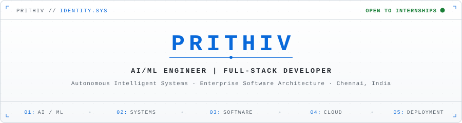
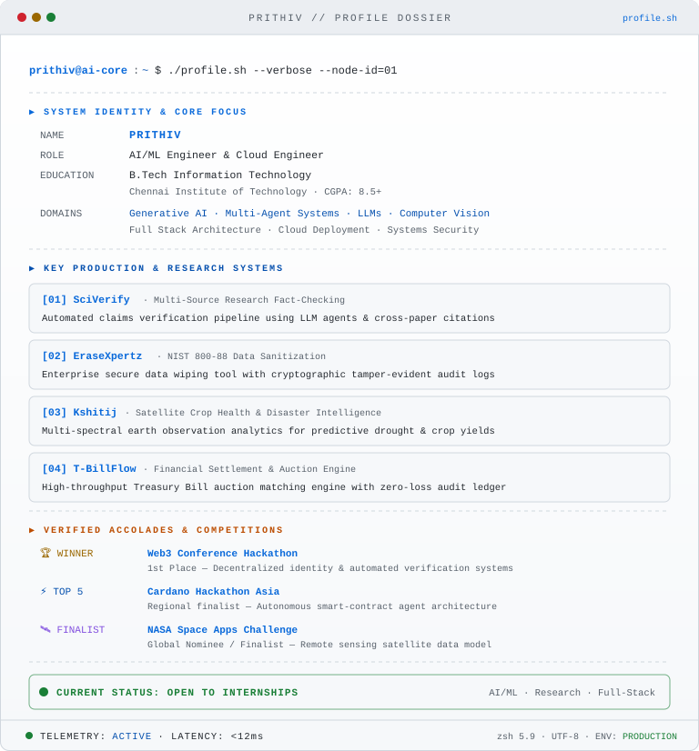
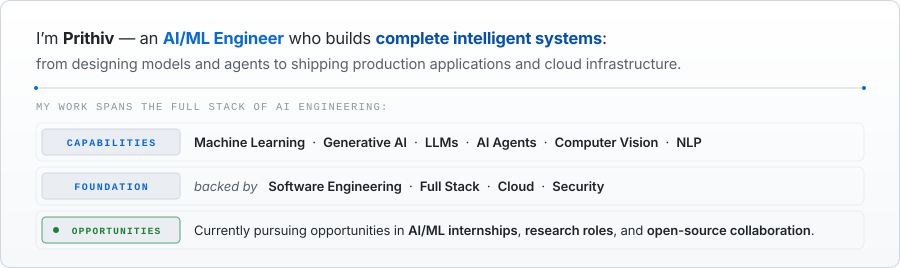

<div align="center">
  <picture>
    <source media="(prefers-color-scheme: dark)" srcset="./assets/hero/identity-hero.svg">
    
  </picture>
</div>

<br>

<div align="center">
<table border="0" cellpadding="0" cellspacing="8" width="100%">
<tr>
<td width="50%" valign="top" align="center">
  <picture>
    <source media="(prefers-color-scheme: dark)" srcset="./assets/hero/ascii-portrait.svg">
    
  </picture>
</td>
<td width="50%" valign="top" align="center">
  <picture>
    <source media="(prefers-color-scheme: dark)" srcset="./assets/hero/terminal-profile.svg">
    
  </picture>
</td>
</tr>
</table>
</div>

<br>

<p align="center">
  <code>IDENTITY &amp; TELEMETRY</code> &nbsp;──►&nbsp; <code>AI SUBSYSTEMS &amp; LIVE CAPABILITIES</code>
</p>

<br>

<picture>
  <source media="(prefers-color-scheme: dark)" srcset="./assets/hero/ai-console.svg">
  
</picture>

<br>

---

## `$ whoami`

<picture>
  <source media="(prefers-color-scheme: dark)" srcset="./assets/hero/whoami-editorial.svg">
  
</picture>

<br>

---

## `> AI / ML CAPABILITIES`

<table>
<tr>
<td valign="top" width="50%">

**AI / ML Core**

      

```
◉ Machine Learning     ◉ Deep Learning
◉ Generative AI        ◉ LLMs / RAG
◉ AI Agents            ◉ Computer Vision
◉ NLP                  ◉ Model Fine-tuning
```

</td>
<td valign="top" width="50%">

**GenAI Stack**

   

```
◉ Prompt Engineering   ◉ RAG Pipelines
◉ Multi-Agent Systems  ◉ Tool Calling
◉ Vector Databases     ◉ Fine-tuning
◉ LLM Orchestration    ◉ Evaluations
```

</td>
</tr>
<tr>
<td valign="top" width="50%">

**Engineering**

     

```
◉ Full Stack Dev       ◉ REST APIs
◉ Microservices        ◉ System Design
```

</td>
<td valign="top" width="50%">

**Cloud · Data · Security**

     

```
◉ Cloud Deploy         ◉ Cybersecurity
◉ Digital Forensics    ◉ Blockchain / Web3
◉ Secure Erasure       ◉ Data Engineering
```

</td>
</tr>
</table>

<br>

---

## `> FEATURED SYSTEMS`

<table>
<tr>
<td valign="top" width="50%">

### `01` — SciVerify
**AI / Scientific Intelligence**

> Multi-agent system that verifies scientific claims against academic evidence with deterministic validation.

```
CLAIM  →  AGENTS  →  EVIDENCE
                ↓
         VALIDATION  →  VERDICT
```

`Python` · `AI Agents` · `Multi-Agent` · `RAG` · `Validation`

**[View Project →](https://github.com/Prithiv04/SciVerify)**

</td>
<td valign="top" width="50%">

### `02` — EraseXpertz
**Cybersecurity / Digital Forensics**

> Secure data erasure platform with forensic verification and comprehensive audit trail.

```
ERASURE  →  VERIFICATION
       ↓
  FORENSICS  →  RECOVERY  →  AUDIT
```

`Python` · `Cybersecurity` · `Digital Forensics` · `Secure Erasure`

**[View Project →](https://github.com/Prithiv04/EraseXpertz)**

</td>
</tr>
<tr>
<td valign="top" width="50%">

### `03` — Kshitij
**Machine Learning / Adaptive Systems**

> Adaptive ML-powered learning platform that personalizes education based on student behavior and performance patterns.

```
STUDENT DATA  →  BEHAVIOR  →  ML MODEL
                        ↓
              ADAPTATION  →  PERSONALIZED LEARNING
```

`Python` · `Machine Learning` · `Adaptive Systems` · `EdTech`

**[View Project →](https://github.com/Prithiv04/Kshitij)**

</td>
<td valign="top" width="50%">

### `04` — T-BillFlow
**Web3 / FinTech**

> Tokenized asset concept implementing smart contracts for T-Bill-like instruments on BSC testnet — exploring Web3 x FinTech integration.

```
TOKENIZATION  →  SMART CONTRACTS
          ↓
    BSC TESTNET  →  WEB3 INTERFACE
```

`Solidity` · `Web3` · `Smart Contracts` · `BSC Testnet` · `FinTech`

**[View Project →](https://github.com/Prithiv04/T-BillFlow)**

</td>
</tr>
</table>

<br>

---

## `> SELECTED RECOGNITION`

<table>
<tr>
<td width="33%" valign="top">

### `01`
**WEB3 CONFERENCE HACKATHON**<br>
<sub>`WINNER` &nbsp;·&nbsp; DELHI &nbsp;·&nbsp; 2024</sub>

</td>
<td width="33%" valign="top">

### `02`
**CARDANO HACKATHON ASIA**<br>
<sub>`TOP 5` &nbsp;·&nbsp; ASIA REGION</sub>

</td>
<td width="34%" valign="top">

### `03`
**NASA SPACE APPS CHALLENGE**<br>
<sub>`FINALIST`</sub>

</td>
</tr>
</table>

<br>

---

## `> CURRENTLY ENGINEERING`

<table>
<tr>
<td width="22%" valign="top"><code>BUILDING</code></td>
<td><strong>AI AGENTS</strong> &nbsp;·&nbsp; <strong>MULTI-AGENT SYSTEMS</strong> &nbsp;·&nbsp; <strong>LLM APPLICATIONS</strong></td>
</tr>
<tr>
<td valign="top"><code>ENGINEERING</code></td>
<td><strong>RAG</strong> &nbsp;·&nbsp; <strong>VECTOR SEARCH</strong> &nbsp;·&nbsp; <strong>TOOL CALLING</strong> &nbsp;·&nbsp; <strong>MODEL EVALUATION</strong></td>
</tr>
<tr>
<td valign="top"><code>SYSTEMS</code></td>
<td><strong>CLOUD DEPLOYMENT</strong> &nbsp;·&nbsp; <strong>REST APIs</strong> &nbsp;·&nbsp; <strong>BACKEND ARCHITECTURE</strong> &nbsp;·&nbsp; <strong>DATA PIPELINES</strong></td>
</tr>
<tr>
<td valign="top"><code>EXPLORING</code></td>
<td>ADAPTIVE ML &nbsp;·&nbsp; REAL-TIME INFERENCE &nbsp;·&nbsp; EDGE AI</td>
</tr>
<tr>
<td valign="top"><code>OPEN TO</code></td>
<td><strong>AI/ML INTERNSHIPS</strong> &nbsp;·&nbsp; <strong>RESEARCH</strong> &nbsp;·&nbsp; <strong>OPEN-SOURCE COLLABORATION</strong></td>
</tr>
</table>

<br>

<p align="center">
  <code>MODELS</code> &nbsp;→&nbsp; <code>AGENTS</code> &nbsp;→&nbsp; <code>DATA</code> &nbsp;→&nbsp; <code>SYSTEMS</code> &nbsp;→&nbsp; <code>DEPLOYMENT</code><br>
  <sub><em>Building intelligent software that can reason, use tools, process evidence, and operate as reliable systems.</em></sub>
</p>

<br>

---

## `> OPEN SOURCE / ENGINEERING`

<p align="center">
  <code>PYTHON</code> &nbsp;·&nbsp; <code>AI/ML</code> &nbsp;·&nbsp; <code>CLOUD</code> &nbsp;·&nbsp; <code>BACKEND</code> &nbsp;·&nbsp; <code>SYSTEMS</code>
</p>

<p align="center">
  <a href="https://github.com/Prithiv04"><strong><code>EXPLORE GITHUB ↗</code></strong></a>
</p>

<br>

---

## `> CONNECT`

<p align="center">
  <a href="https://linkedin.com/in/prithiv04">
    
  </a>
  &nbsp;
  <a href="https://github.com/Prithiv04">
    
  </a>
  &nbsp;
  <a href="mailto:prithiv.contact@gmail.com">
    
  </a>
</p>

<br>

---

<picture>
  <source media="(prefers-color-scheme: dark)" srcset="./assets/footer/terminal-footer.svg">
  
</picture>

<br>

<p align="center">
  <sub>
    Profile built with custom SVG + SMIL · No runtime JS · GitHub-native rendering<br>
    <a href="./ATTRIBUTIONS.md">Attributions</a>
  </sub>
</p>
