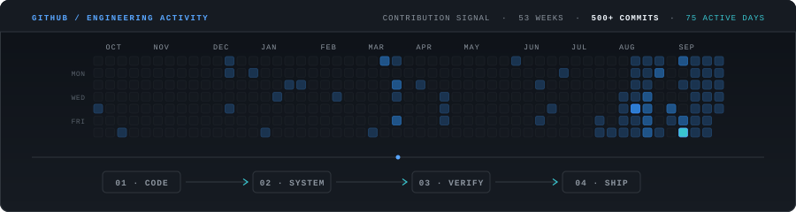

Build our own — REAL CONTRIBUTIONS → ENGINEERING ACTIVITY VISUALIZER

The key is: use your actual GitHub contribution data, but create an original animation around it.

1. The concept

Instead of:

🐍 Snake eating contributions

we make:

COMMITS → SIGNAL → SYSTEM → DEPLOY

Think of it as a miniature engineering telemetry visualization.

Something like:

┌───────────────────────────────────────────────────────────────┐
│  ENGINEERING ACTIVITY                              2026      │
│                                                               │
│  CONTRIBUTION SIGNAL                                          │
│                                                               │
│  ░ ░ ░ ▒ ░ ░ ░ ░ ░ ░ ▒ ░ ░ ░ ░ ░ ░ ░ ░ ▒ ░ ░ ░ ░ ░ ░ ░    │
│  ░ ▒ ▒ ▓ ░ ░ ░ ▒ ░ ░ ░ ░ ░ ▒ ▓ ░ ░ ░ ░ ░ ░ ▒ ░ ░ ░ ░ ░    │
│  ░ ░ ░ ░ ░ ▒ ▓ ▓ ░ ░ ░ ░ ░ ░ ░ ▒ ░ ░ ░ ░ ░ ░ ░ ░ ░ ░ ░    │
│                                                               │
│             ────────────────●──────────────→                  │
│                         ACTIVITY FLOW                         │
│                                                               │
│  COMMIT → BUILD → TEST → SHIP → REPEAT                        │
└───────────────────────────────────────────────────────────────┘

But visually much more premium than this ASCII representation.

2. What makes it different

The contribution grid remains recognizable.

But instead of simply displaying squares:

Phase 1 — Grid initializes

The calendar appears almost empty.

INITIALIZING ACTIVITY...

Then the real contribution cells progressively materialize.

Phase 2 — Signal scan

A thin cyan/blue scanning line moves across the calendar.

As it reaches a contribution:

cell → subtle illumination → settles

The animation communicates:

activity being processed.

Phase 3 — Activity flow

After the grid is revealed, a very subtle line travels through:

CONTRIBUTIONS
      ↓
BUILD
      ↓
TEST
      ↓
SHIP

Not literally a flowchart — more like a thin data signal.

Phase 4 — Idle state

The animation stops.

The contribution graph remains static.

Then after a long delay, the scan starts again.

This is important.

Don't have something moving constantly for attention.

3. Use REAL GitHub data

This is the most important technical part.

We should never manually create fake contribution cells.

The generator fetches your actual GitHub contribution calendar.

There are already open-source implementations that fetch GitHub contribution data and turn it into self-contained SVGs. For example, animated-github-profile fetches the public contribution calendar and generates SVG output through GitHub Actions.

We can use the same general engineering principle but create our own visual system.

Architecture:

GitHub Contribution Data
          ↓
Contribution Parser
          ↓
53 × 7 Contribution Matrix
          ↓
SVG Renderer
          ↓
Animated SVG
          ↓
assets/github/
          ↓
README.md
4. GitHub Action

Your existing profile repo already has GitHub Actions infrastructure.

We create:

.github/
└── workflows/
    └── refresh-contributions.yml

Workflow:

scheduled execution
       ↓
fetch GitHub activity
       ↓
generate contribution data
       ↓
generate SVG
       ↓
validate SVG
       ↓
commit changed SVG

Run it:

daily or every 12 hours
manually with workflow_dispatch
optionally on push

So your README doesn't depend on some random third-party API every time somebody opens your profile.

That's much better engineering.

5. File architecture

I'd build it like this:

generators/
└── github/
    ├── fetch_contributions.py
    ├── generate_activity_svg.py
    ├── theme.py
    └── validate_svg.py

data/
└── github/
    └── contributions.json

assets/
└── github/
    ├── activity.svg
    ├── activity-static.svg
    └── activity-light.svg

.github/
└── workflows/
    └── refresh-contributions.yml

This also fits the architecture you've already established for the profile.

6. The SVG itself

The SVG should be self-contained.

No JavaScript.

No external fonts.

No external API calls.

No iframe.

Something like:

900 × ~240 SVG

Inside:

Header
GITHUB / ENGINEERING ACTIVITY

Small metadata:

CONTRIBUTION SIGNAL · 52 WEEKS
Main

Actual GitHub contribution grid.

Bottom
MODEL → BUILD → TEST → DEPLOY

or preferably:

CODE → SYSTEM → VERIFY → SHIP

This connects GitHub activity to your engineering identity.

7. Animation timeline

I'd make the animation around 8–12 seconds, but not continuously restart aggressively.

0.0–1.0 sec

Header:

ENGINEERING ACTIVITY

reveals.

1.0–3.5 sec

Contribution cells appear progressively.

Low activity:

░

Medium:

▒

High:

▓
3.5–6.0 sec

Scanning signal travels across the grid.

Something like:

───────────────────────→

but visually extremely subtle.

6.0–8.0 sec

Signal reaches:

CODE → SYSTEM → VERIFY → SHIP

and the four stages illuminate sequentially.

8.0–10.0 sec

Everything settles.

10+ sec

Static.

Then optionally repeat after ~20–30 seconds.

8. Contribution intensity

We should preserve the actual relative activity.

For example:

0 contributions     → empty
1–2                 → level 1
3–5                 → level 2
6–10                → level 3
10+                 → level 4

But don't hardcode these blindly.

Normalize based on your actual contribution distribution so the visualization doesn't look almost empty or completely saturated.

The important thing:

The visualization represents your actual GitHub activity.

9. Color system

Don't use standard GitHub green.

For your profile I'd use:

Background     near-black
Grid           muted charcoal
Low activity   dark gray-blue
Medium         muted blue
High           cyan/blue accent
Text           off-white
Metadata       gray

One accent.

No rainbow.

No purple.

No neon cyberpunk.

This will make it match your:

PRITHIV / IDENTITY.SYS

and your AI engineering visual language.

10. Light mode

Absolutely build:

activity.svg
activity-light.svg
activity-static.svg

Then README:

<picture>
  <source
    media="(prefers-color-scheme: dark)"
    srcset="./assets/github/activity.svg"
  />
  <source
    media="(prefers-color-scheme: light)"
    srcset="./assets/github/activity-light.svg"
  />
  
</picture>

GitHub profile READMEs support images and <picture> for theme-aware content.

11. Reduced-motion version

This is mandatory.

If the user has reduced motion enabled, don't run the cinematic sequence.

Instead:

activity-static.svg

Just show the contribution graph.

So:

Normal visitor
     ↓
Animated SVG

Reduced motion
     ↓
Static SVG
12. Accessibility

Don't rely on the SVG to communicate information alone.

Give it an alt description:

GitHub contribution activity over the past year, visualized as an engineering activity signal.

And the surrounding Markdown can say:

> ENGINEERING ACTIVITY
>
> A visual record of the systems I build, test, and ship.
13. What I would NOT do
❌ GitHub Snake

Too common.

❌ Pac-Man

Fun, but destroys your serious engineering positioning.

❌ Space Invaders

Same problem.

❌ Matrix rain

Looks like hacker/cyberpunk branding.

❌ GitHub stats card

Too generic.

❌ Huge contribution calendar

Looks like every other developer README.

❌ Fake "CURRENT STREAK: 394 DAYS"

Absolutely not.

❌ Fake telemetry

No:

SYSTEM LOAD 98%
UPTIME 99.99%
AI INFERENCE 8472

unless those are actually real metrics.

14. One open-source project I'd study

I'd specifically study the architecture of:

animated-github-profile

because it already demonstrates the exact important concept: real contribution data → generated SVG → GitHub Action → self-hosted animated asset, without depending on a third-party stats service.

Another interesting reference is:

Comet Contribution Graph

It demonstrates a much more cinematic approach: the actual contribution grid becomes a visual scene with a moving comet tracing productive days.

But I would not copy either design.

Study the implementation.

Build our own visual language.

15. The final section in your README

I would make the section look conceptually like:

> ENGINEERING / GITHUB

ENGINEERING IN MOTION

A visual record of the systems I build,
test, verify, and ship.

        [ REAL CONTRIBUTION GRAPH ]

CODE ───────── SYSTEM ───────── VERIFY ───────── SHIP

        EXPLORE GITHUB ↗

And the animation lives primarily inside the SVG.

This keeps the actual README clean.

16. Even better: connect it to your existing story

This is where I think we can make your README 10/10.

Your profile already communicates:

INTELLIGENCE
      ↓
DATA
      ↓
SYSTEMS
      ↓
SOFTWARE
      ↓
CLOUD

Your GitHub section could visually continue that:

BUILD
   ↓
CONTRIBUTE
   ↓
VERIFY
   ↓
SHIP

So the profile has a coherent visual narrative.

Not:

"Here's another random GitHub widget."

Instead:

This is the engineering activity behind the person you've been reading about.

17. Final implementation plan

I'd do it in 3 phases.

PHASE A — DATA ENGINE

Build:

fetch_contributions.py
contributions.json

Test against your actual GitHub profile.

Verify:

52/53 weeks
7 days/week
correct dates
correct contribution counts
timezone/date handling
no fabricated values
PHASE B — VISUAL ENGINE

Build:

generate_activity_svg.py

Generate:

activity.svg
activity-static.svg
activity-light.svg

Implement:

contribution grid
intensity mapping
scan animation
activity signal
CODE → SYSTEM → VERIFY → SHIP
dark mode
light mode
reduced-motion/static variant

Then manually inspect the SVG.

PHASE C — AUTOMATION

Add:

.github/workflows/refresh-contributions.yml

Pipeline:

GitHub Action
     ↓
Fetch contributions
     ↓
Generate SVG
     ↓
Validate
     ↓
Commit only if changed
     ↓
README automatically updates

Then place it under your OPEN SOURCE / ENGINEERING section.

18. The final visual hierarchy

Your README would then have something like:

PRITHIV
AI/ML ENGINEER | CLOUD ENGINEER
Autonomous Intelligent Systems · Enterprise Software Architecture · Chennai, India

             ↓

$ whoami

             ↓

AI / ML CAPABILITIES

             ↓

SELECTED PROJECTS

             ↓

SELECTED RECOGNITION

             ↓

CURRENTLY ENGINEERING

             ↓

ENGINEERING IN PUBLIC
┌─────────────────────────────────────────────┐
│                                             │
│       REAL GITHUB CONTRIBUTIONS             │
│                                             │
│   ░ ▒ ░ ░ ▓ ░ ░ ▒ ░ ░ ░ ░ ▓ ░             │
│   ░ ░ ▒ ▓ ▓ ░ ░ ░ ▒ ░ ░ ░ ░ ░             │
│   ▒ ░ ░ ░ ▒ ░ ▓ ▓ ░ ░ ░ ▒ ░ ░             │
│                                             │
│   CODE → SYSTEM → VERIFY → SHIP             │
│                                             │
└─────────────────────────────────────────────┘

             ↓

LET'S BUILD SOMETHING.

             ↓

PRITHIV

That's the direction I'd choose.

It gives you the animated GitHub element you want, uses real contribution data, can update itself automatically, is self-hosted, fits the existing visual identity, and—most importantly—doesn't make your profile look like a collection of random GitHub widgets.